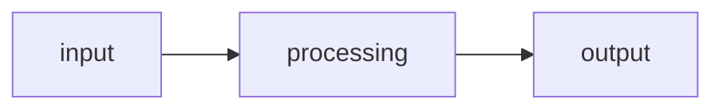
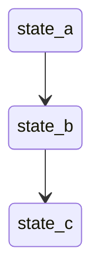

# Spec: [Feature Name]

## Status

`Draft` | `In Review` | `Approved` | `Implementing` | `Done`

## Work item and ownership

- **Parent:** [epic / story / task link]
- **Owner:** [person accountable for acceptance and escalation]
- **Artifact version:** [commit, document version, or immutable reference]

---

## Goal

What changes and why. One paragraph, written for someone who knows the codebase but not this feature. Focus on the outcome, not the implementation.

---

## Assumptions

Things we believe to be true but have not verified. Each assumption includes the consequence if it turns out to be wrong — this forces you to evaluate which assumptions are load-bearing.

- **[Assumption]** — if wrong: [what breaks and what we'd need to change]
- **[Assumption]** — if wrong: [what breaks and what we'd need to change]

---

## Modules and interfaces affected

Which modules this work touches, and what happens at each one's interface. An interface change propagates to every caller — human and AI, in every future session — so it deserves the most scrutiny in review.

| Module | Interface change | How the interface is tested |
|--------|-----------------|-----------------------------|
| [module/path] | none / extended / breaking: [what changes for callers] | [contract test, migration preview, ...] |
| [module/path] | ... | ... |

---

## Approach

### High-level stages

Implementation stages in dependency order. Each stage should produce a coherent, independently checkable result another engineer can resume.

| Stage | Outcome | Boundary | Required evidence | Depends on |
|-------|---------|----------|-------------------|------------|
| 1 | [description] | [what this stage must not invent or change] | [checks and proof] | — |
| 2 | [description] | [boundary] | [checks and proof] | Stage 1 |
| 3 | [description] | [boundary] | [checks and proof] | Stage 1 |

### Data flow

How data moves through the system for the primary use case. Use a diagram — Mermaid preferred, ASCII acceptable.

### State machine (if applicable)

Valid state transitions for the core entity.

---

## Decisions

Each decision documents the alternatives considered, the choice made, and — critically — **why**. This prevents AI from re-deriving decisions and picking a different option next time.

### [Decision 1 title]

- **Option A:** [description]
- **Option B:** [description]
- **Chosen:** [A or B]
- **Why:** [reasoning]

### [Decision 2 title]

- **Option A:** [description]
- **Option B:** [description]
- **Chosen:** [A or B]
- **Why:** [reasoning]

---

## Scope boundaries

What this feature does NOT include. Be explicit — this is the primary defense against AI over-generation. If it's not listed here, AI will assume it's in scope.

- NOT included: [thing and why it's excluded]
- NOT included: [thing and why it's excluded]
- NOT included: [thing and why it's excluded]

---

## Risks

| Risk | Impact | Mitigation |
|------|--------|------------|
| [what could go wrong] | [what breaks] | [how to prevent or detect] |
| [what could go wrong] | [what breaks] | [how to prevent or detect] |

---

## Open questions

Things that must be resolved before implementation begins. Each question notes who or what can answer it.

- [ ] [Question] — ask [person/team] or verify in [documentation]
- [ ] [Question] — ask [person/team] or verify in [documentation]

---

## Dependencies

Other features, services, or decisions this spec depends on.

- [dependency and its current status]

---

## Test strategy

How to verify the implementation. Not test code — describe **what scenarios must pass** and how to exercise them.

| Scenario | How to verify |
|----------|---------------|
| [happy path] | [what to check] |
| [edge case] | [what to check] |
| [failure mode] | [what to check] |

---

## Terminals and escalation

| Terminal | Required record | Next decision |
|---|---|---|
| Succeeded | [artifact and acceptance evidence] | [accept or deliver] |
| Blocked / failed | [missing dependency or disproved approach] | [wait, redirect, or restart] |
| Uncertain | [last confirmed state and possible effects] | [reconcile before continuing] |
| Cancelled / exhausted | [owner, reason, attempts or budget] | [archive, recover, or escalate] |

## Handoff state

- **Completed:** [what changed and evidence]
- **Current terminal:** [working / blocked / failed / uncertain / cancelled / exhausted]
- **Contradictions or uncertainty:** [what does not fit]
- **Next safe action:** [action another engineer can take]
- **Escalate to:** [owner and missing decision or authority]
